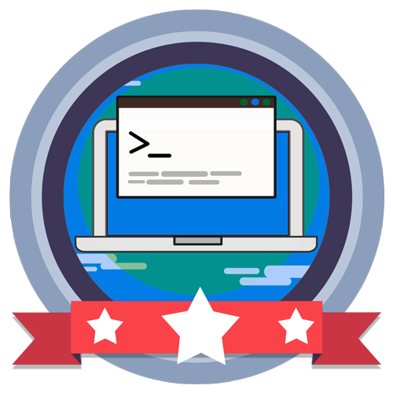

<!-- Badges session -->

  
  <!-- languages -->
  
  <!-- repo size -->
  
  <!-- last commit -->
  
  <!-- licence MIT -->
  

<!--Banner session-->

  

<!--About session-->
<h1 align="center">Desenvolvendo sua aplicação com C# usando DDD Digital Innovation One</h1>

Curso do Bootcamp Decola Dev Avanade 2021 da [Digital Innovation One](https://digitalinnovation.one/).

Neste projeto aprenda a desenvolver aplicações robustas alinhadas a complexidade da lógica de negócios. O seu desafio é organizar a estrutura de pastas do projeto conforme implementada pelo expert!

<!--License session-->
<h3>📝 Licença</h3>

- Este projeto está sob a licença [MIT](./LICENSE). 

<!--Bottom session-->
 <h4 align=center>Made with by <a target="_blank" href="https://pleiterson.vercel.app" >Pleiterson Amorim</a></h4>